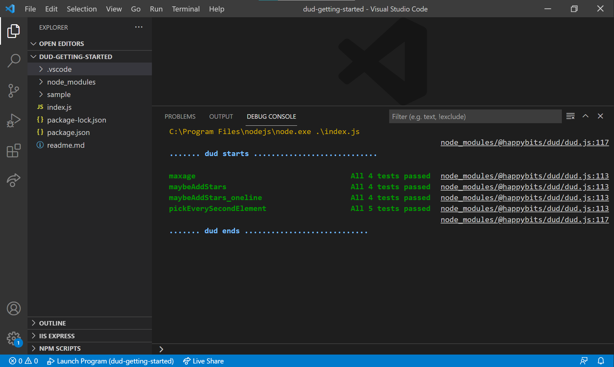

# Getting started 

This is a project to get started with **dud.js**

If you haven't installed node.js [do that here](https://nodejs.org/en/)

Just download this repo and open this folder in Visual Studio Code. The write the following in the terminal to install:

    npm install

Press F5. If you see a screen like this everything works fine:

Try to introduce an error in one of the functions, e.g **pickEverySecondElement**. Run with F5. See what happens.

Here is a link to the used package: [dud.js](https://www.npmjs.com/package/@happybits/dud)

## Join me 

Interested in developing this idea in JavaScript or another language like C#?

Send a mail to oo@happybits.se

Oscar